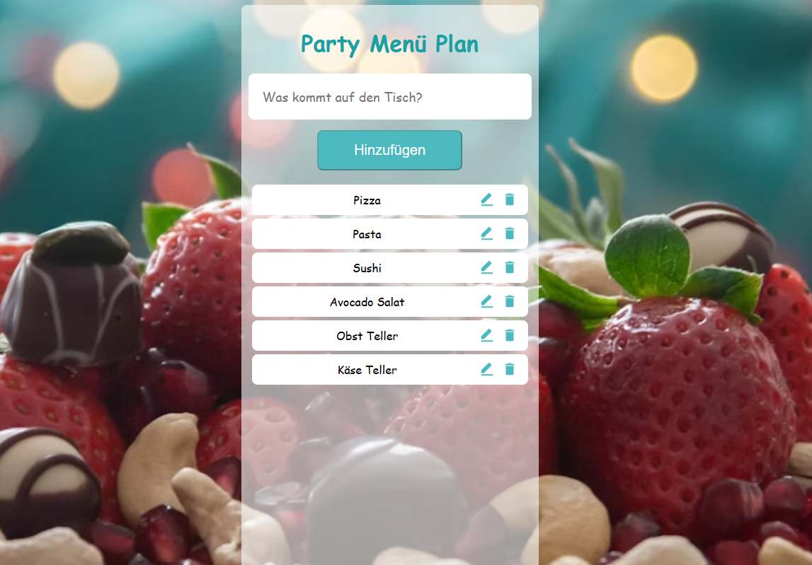

# Meal Plan App

Eine kleine Full-Stack-App zum Verwalten von Mahlzeiten (Create, Read, Update, Delete).
Du kannst neue Meals hinzufügen, bestehende bearbeiten oder löschen.
Frontend: React + Axios · Backend: Node/Express + MongoDB (Mongoose) · Deployment: Render

## 🚀 Demo

Backend (Render): https://meal-plan-backend-zdxx.onrender.com

→ GET / liefert die aktuelle Liste der Meals.

## 📋 Features

✍️ Meal anlegen (Titel eingeben → „Add“)

✏️ Meal bearbeiten (per ✎ Icon → „Edit“)

🗑️ Meal löschen (per 🗑 Icon)

🔄 Liste lädt automatisch nach jeder Aktion neu

⚠️ „Add“ ist deaktiviert, solange das Eingabefeld leer ist (!title.trim())

📦 Axios für HTTP-Requests

🌐 CORS aktiviert, geeignet für getrennte Frontend/Backend-Deployments

## 🛠️ Technologien

- **Frontend**: React (Hooks: useState, useEffect), react-icons, CSS

- **Backend**: Node.js, Express, Mongoose, CORS, dotenv

- **DB**: MongoDB Atlas (oder lokale MongoDB)

- **Deployment**: Render (Backend)

## 📱 Responsives Design

Die App passt sich an verschiedene Bildschirmgrößen an und unterstützt sowohl mobile Geräte als auch Desktop-Bildschirme. Es wurden Flexbox und Media Queries verwendet, um sicherzustellen, dass die App auf unterschiedlichen Geräten optimal aussieht.

## ✨ Mitwirkende

Yulia Siebrandt - Projektentwicklung 

## 📧 Kontakt 

Wenn du Fragen oder Vorschläge hast, melde dich gerne bei mir über [siebrandt.dev@gmail.com](mailto:siebrandt.dev@gmail.com)